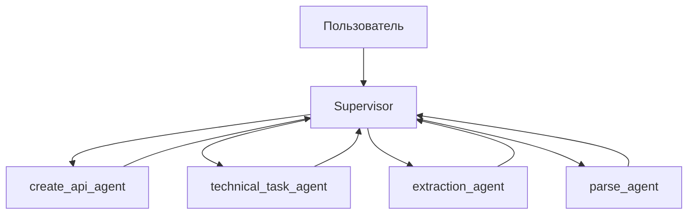

# 🚀 DOC.AI — Интеллектуальный ассистент для автоматизации документации и технических задач

## 💡 **Суть проекта**
DOC.AI — это интеллектуальный ассистент для автоматизации создания технических заданий, документации и других текстовых материалов. Система преобразует хаотичные, неформальные идеи в четкие, структурированные документы, готовые к использованию.

**Целевая аудитория:** программисты, бухгалтеры, студенты и школьники, которым регулярно приходится писать документы: от технических заданий до учебных работ.

**Примеры возможностей:**
- Генерация технических заданий с учетом всех требований для разработчиков
- Создание описаний лабораторных работ для студентов
- Генерация учебных заданий с адаптацией.
- Извлечение данных из файлов (PDF, DOCX, TXT).
- Формирование структурированных документов без ручного копирования информации

## **Почему это ценно?**
- **Автоматизация рутинных задач** — экономия до 70% времени на создание документации
- **Унификация требований** — снижение ошибок из-за неясности формулировок (никаких "квадратов вместо кругов")
- **Работа с файлами** — извлечение и структурирование данных из документов различного формата
- **Адаптивность** — система автоматически подстраивается под сложность задачи и целевую аудиторию
- **Надежность** — 0% ошибок в сгенерированном коде и документации

## ⚙️ **Архитектура системы**
DOC.AI построен на современной многоагентной архитектуре с использованием LLM-моделей и key-value хранилища для управления состоянием и контекстом. Система основана на центральном компоненте - Supervisor, который управляет всем процессом.

### 🔄 Основной рабочий поток


Где:
- `Supervisor` — центральный компонент системы, который:
  * Включает человека в цикл обработки (human in the loop)
  * Распределяет задачи и вызывает других агентов
  * Имеет память для хранения контекста общения с пользователем

- `create_api_agent` — отвечает за:
  * Поиск в интернете
  * Создание документации по коду и запросу пользователя

- `technical_task_agent` — отвечает за:
  * Поиск в интернете
  * Создание ТЗ по запросу пользователя

- `extraction_agent` — отвечает за:
  * Извлечение содержимого документов
  * Извлечение JSON из текста
  * Извлечение данных из файлов

- `parse_agent` — отвечает за:
  * Выполнение Python-кода
  * Сохранение скриптов
  * Преобразование пользовательских данных в различные форматы и сохранение их

## 📊 **Ключевые метрики эффективности**
- **93% точность** извлечения данных из документов
- **4.8 из 5** – оценка полезности сгенерированных технических заданий от пользователей
- **0% ошибок** в системе — отсутствие сбоев за период тестирования
- **21 секунда** — среднее время ответа (в 3 раза быстрее ручного написания)
- **5000–6300 токенов** — стоимость генерации сценария, что делает решение экономически выгодным

## **Технический стек**
- Язык программирования: Python 3.13
- LLM-модель: xiaomi/mimo-v2-flash:free с сайта OpenRouter
- Агентная архитектура: Многопоточные агенты с обратной связью и циклической оптимизацией
- Интерфейс: Консольный UI с возможностью работы с файлами различного формата

## 🧩 **Функциональные возможности**

### 🔍 **Поиск и анализ информации**
- Интеллектуальный веб-поиск для сбора актуальных данных
- Анализ и синтез информации из различных источников
- Проверка достоверности информации через кросс-валидацию источников

### 📄 **Работа с документами**
- Поддержка форматов: PDF, DOCX, TXT, JSON, CSV
- Извлечение структурированной информации из неструктурированных текстов
- Конвертация данных между различными форматами
- Автоматическое форматирование и стилизация документов

### 🛠️ **Генерация технической документации**
- Создание технических заданий по шаблонам ГОСТ и ISO
- Формирование спецификаций и API-документации
- Автоматическая проверка соответствия требованиям
- Генерация диаграмм и схем на основе описания

### 🤖 **Интеллектуальная обработка**
- Понимание естественного языка на уровне профессиональной терминологии
- Контекстное хранение и использование истории взаимодействия
- Адаптация сложности и стиля документации под целевую аудиторию
- Автоматическая оптимизация и улучшение результатов

## 🏗️ **Архитектурные особенности**

### **Многоуровневая система обработки**
- Уровень ввода: обработка пользовательских запросов и загрузка файлов
- Уровень анализа: семантический анализ и классификация задач
- Уровень выполнения: распределение задач между агентами
- Уровень вывода: формирование итоговых документов

### **Система управления состоянием**
- Хранение контекста сессии в key-value хранилище
- Поддержка долгосрочных взаимодействий с сохранением прогресса
- Возможность отката и коррекции промежуточных результатов
- Механизмы самодиагностики и восстановления

### **Механизмы безопасности**
- Изоляция пользовательских данных
- Шифрование конфиденциальной информации
- Контроль доступа к файловой системе
- Защита от инъекций и нежелательного кода

## 📈 **Преимущества для разных категорий пользователей**

### **Для разработчиков**
- Автоматическая генерация технических заданий из устных требований
- Создание документации API на основе кода
- Формирование отчетов о тестировании и покрытии кода
- Упрощение процесса code review через структурированные описания

### **Для студентов и школьников**
- Помощь в написании курсовых и дипломных работ
- Создание отчетов по лабораторным работам
- Форматирование документов по требованиям учебных заведений
- Генерация примеров и тестовых заданий

### **Для бухгалтеров и офисных работников**
- Автоматическое заполнение стандартных форм и бланков
- Создание финансовых отчетов из неструктурированных данных
- Формирование актов, договоров и других юридических документов
- Обработка и классификация входящих документов

## 🚀 **Быстрый старт**

### **Требования**
- Python 3.13 или выше
- Доступ к интернету для работы с LLM
- Установленный git для клонирования репозитория

### **Установка**
```bash
git clone https://github.com/your-repo/docai.git
cd docai
pip install -r requirements.txt
```

### **Настройка**
1. Зарегистрируйтесь на OpenRouter и получите API-ключ
2. Создайте файл `.env` с настройками:
```
OPENROUTER_API_KEY=ваш_api_ключ
```

### **Запуск**
```bash
python main.py
```

## 📋 **Примеры использования**

### **Создание технического задания**
```
Пользователь: "Нужно сделать сайт для онлайн-магазина"
Система: Генерирует полное ТЗ с требованиями, функционалом, интерфейсами
```

### **Обработка документа**
```
Пользователь: Загружает PDF с финансовыми отчетами
Система: Извлекает ключевые показатели, создает таблицы и графики
```

### **Генерация отчета**
```
Пользователь: "Сделай отчет по лабораторной работе по физике"
Система: Формирует структурированный отчет с формулами и выводами
```
